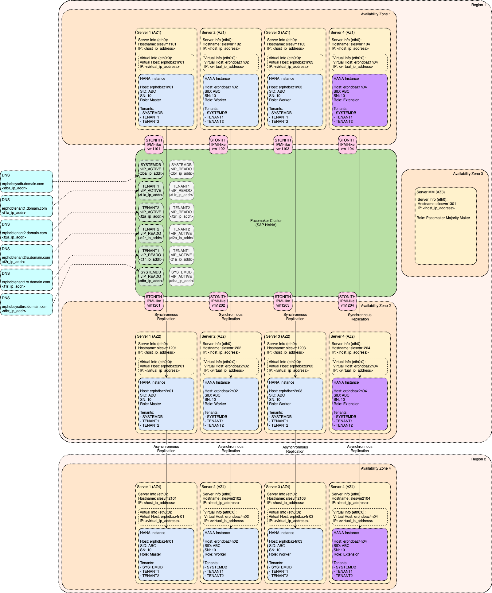

# Module: Data Tiering Options

SAP if offering range of capabilities how to optimize costs by segregating data into different storage and processing tiers. This module is discussing how individual Data Tiering options can be implemented as part of this Reference Architecture.

<!-- TOC -->

- [Module: Data Tiering Options](#module-data-tiering-options)
  - [Overview of Data Tiering Options for SAP HANA](#overview-of-data-tiering-options-for-sap-hana)
  - [Persistent Memory (Non-Volatile Random Access Memory - NVRAM)](#persistent-memory-non-volatile-random-access-memory---nvram)
  - [SAP HANA Native Storage Extensions (NSE)](#sap-hana-native-storage-extensions-nse)
  - [SAP HANA Extension Nodes](#sap-hana-extension-nodes)
  - [SAP HANA Dynamic Tiering (DT)](#sap-hana-dynamic-tiering-dt)

<!-- /TOC -->

## Overview of Data Tiering Options for SAP HANA

SAP is dividing the data based on the aging characteristics of the data and frequency of usage. Following data temperature tiers and tiering options are available:

- Hot Data
  - Dynamic Random Access Memory (DRAM)
  - Persistent Memory (Non-Volatile Random Access Memory - NVRAM)
- Warm Data
  - Native Storage Extensions (NSE)
  - Extension Nodes
  - Dynamic Tiering (DT)
- Cold Data
  - SAP Data Hub / SAP Data Intelligence
  - SAP HANA Spark Controller (Hadoop)

Selected Data Tiering Options are discussed in sections below.

Additional Information:

- [Administration Guide: Data Tiering](https://help.sap.com/viewer/6b94445c94ae495c83a19646e7c3fd56/2.0.04/en-US/00421f8985a14e1b878195f4ce829be9.html)

## Persistent Memory (Non-Volatile Random Access Memory - NVRAM)

SAP HANA in-memory data can be divided into following usage types:

- Main Data fragments (the in-memory copy of tables; infrequent changes)
- Delta Data fragments (update information; frequent changes)
- Temporary Data fragments (computational data; very frequent changes)

Server memory must be combination of Traditional RAM (`DRAM`) and Persistent Memory (`NVRAM`). Traditional RAM (`DRAM`) is required during Operating System start and is also offering better performance for write operations. On the other hand Persistent RAM (`NVRAM`) is cheaper and bigger and almost as fast as `DRAM` for read operations.

Therefore, Persistent Memory is intended only for Main Data fragments of Column Store tables that are changed very infrequently (only during Delta Merge operation).

Persistent Memory is supported since SAP HANA 2.0 SP03 (revision 35 and higher) and SAP HANA 2.0 SP04.

Usage of Persistent Memory can be activated on the level of whole SAP HANA Database, selected Tables, selected Table Partitions or only selected Table Columns.

Although mixed combinations with primary systems having Persistent Memory and secondary systems without Persistent Memory and visa versa are supported, it is not recommended for High Availability purpose. In any case proper memory sizing must be ensured to avoid out-of-memory situations after takeover.

Additional Information:

- [Administration Guide: The Delta Merge Operation](https://help.sap.com/viewer/6b94445c94ae495c83a19646e7c3fd56/2.0.04/en-US/bd9ac728bb57101482b2ebfe243dcd7a.html)
- [Administration Guide: Persistent Memory](https://help.sap.com/viewer/6b94445c94ae495c83a19646e7c3fd56/2.0.04/en-US/1f61b13e096d4ef98e62c676debf117e.html)
- [SAP Note 2618154: SAP HANA Persistent Memory - Release Information](https://launchpad.support.sap.com/#/notes/2618154)
- [SAP Note 2700084: FAQ: SAP HANA Persistent Memory](https://launchpad.support.sap.com/#/notes/2700084)

## SAP HANA Native Storage Extensions (NSE)

SAP HANA is offering native option how to manage less frequently accessed data using built-in warm data store capability called Native Storage Extensions (NSE).

Data management of hot data is well described in [Administration Guide: Memory Management in the Column Store](https://help.sap.com/viewer/6b94445c94ae495c83a19646e7c3fd56/2.0.04/en-US/bd6e6be8bb5710149e34e14608e07b76.html).

Hot data is normally stored in "In-Memory Column Store". SAP HANA is automatically loading complete data structures (Table Columns or Table Column Partitions) into the memory based on first usage and will keep all data in memory as long as possible. These data structures are unloaded from memory only in case that allocated memory has reached the maximum limit and memory is required for processing other workload. In such case least recently used data structures are unloaded first.

SAP HANA Native Storage Extensions functionality is offering different approach based on "Disk Based Column Store". It can be activated for selected database objects (tables, partitions or columns). The data structures (Table Columns or Table Column Partitions) are kept on disk and only selected data pages are loaded into memory into "Buffer Cache". This concept if well known from all other classical databases.

By using "Buffer Cache" that is significanly smaller than size of data in "Disk Based Column Store", Native Storage Extensions capability is increasing maximum amount of data that can be stored in SAP HANA database. Therefore, total storage requirements are also increased which needs to be reflected by infrastructure.

SAP HANA Native Storage Extension feature is supported since SAP HANA 2.0 SP04 and is limited only to Single-node SAP HANA Systems. Please note other functional restrictions as mentioned in [SAP Note 2771956: SAP HANA Native Storage Extension Functional Restrictions](https://launchpad.support.sap.com/#/notes/2771956).

- [Administration Guide: SAP HANA Native Storage Extension](https://help.sap.com/viewer/6b94445c94ae495c83a19646e7c3fd56/2.0.04/en-US/4efaa94f8057425c8c7021da6fc2ddf5.html)
- [SAP HANA Native Storage Extension Whitepaper](https://www.sap.com/documents/2019/09/4475a0dd-637d-0010-87a3-c30de2ffd8ff.html)
- [SAP Note 2799997: FAQ: SAP HANA Native Storage Extension (NSE)](https://launchpad.support.sap.com/#/notes/2799997)

## SAP HANA Extension Nodes

SAP HANA Scale-Out Systems can leverage SAP HANA Extension Nodes capability - new type of SAP HANA instance used exclusively for warm data.

SAP HANA Extension Node (configured as a slave node, worker group value `worker_dt`) is storing the warm data in "In-Memory Column Store" like regular SAP HANA node used for hot data. Since the warm data is less frequently used, the performance for `SELECT` statements against this data is not seen as important. Therefore, we can overload this node with amount of data to be doubled or in some cases even quadrupled.

Because the data is stored in "In-Memory Column Store" the internal mechanics is same as described in [Administration Guide: Memory Management in the Column Store](https://help.sap.com/viewer/6b94445c94ae495c83a19646e7c3fd56/2.0.04/en-US/bd6e6be8bb5710149e34e14608e07b76.html) and in previous section. Due to a high volume of data in given node, the data structures are loaded and unloaded much more often than hot data in other nodes. Since this is associated with performance degradation, the Extension Node must be dedicated only for warm data.

Warm data must be placed in separate Tables or in separate Table Partitions. Subsequently those Tables and Table Partitions are relocated to SAP HANA Extension Node(s). Note that as described in [Module: Basic Architecture](module_basic_architecture.md#module-basic-architecture) each SAP HANA node is having its own subset of data in its own data files.

SAP HANA Extension Nodes are supported since SAP HANA 1.0 SP12 (for BW scenario) and since SAP HANA 2.0 SP03 (native scenario) and are limited only to Scale-Out SAP HANA Systems.

For SAP BW scenarios the hardware used for SAP HANA Extention Nodes can differ compared to other worker nodes starting from SAP HANA 2.0 SP03. For native scenarios this is supported from SAP HANA 2.0 SP4.

- [Administration Guide: Extension Node](https://help.sap.com/viewer/6b94445c94ae495c83a19646e7c3fd56/2.0.04/en-US/e285ac03529a4cc9ab2d73206d2e8eca.html)
- [Administration Guide: Redistributing Tables in a Scaleout SAP HANA System](https://help.sap.com/viewer/6b94445c94ae495c83a19646e7c3fd56/2.0.04/en-US/c6579b60d9761014ae59c8c868e6e054.html)
- [More Details – HANA Extension Nodes for BW-on-HANA](http://scn.sap.com/community/bw-hana/blog/2016/04/26/more-details--hana-extension-nodes-for-bw-on-hana)

## SAP HANA Dynamic Tiering (DT)

Not possible in combination with Pacemaker Clustering

https://help.sap.com/viewer/product/SAP_HANA_DYNAMIC_TIERING/2.00.04/en-US