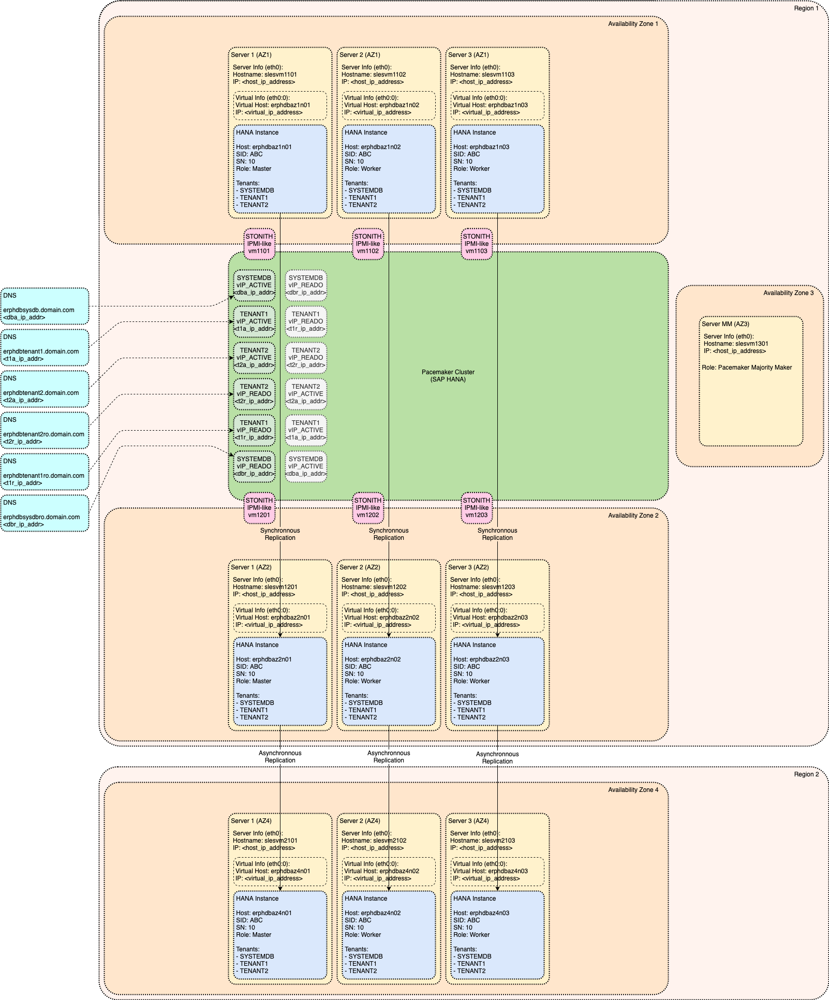

# Module: Disaster Recovery

Disaster Recovery module is enhancing the design by adding protection against regional disaster. Such disaster events can be caused by nature (floods, tornadoes, hurricanes or earthquakes), by humans (strikes, terrorism) or by technology (power blackout).

<!-- TOC -->

- [Module: Disaster Recovery](#module-disaster-recovery)
  - [Disaster Recovery Concept](#disaster-recovery-concept)

<!-- /TOC -->

## Disaster Recovery Concept

All events mentioned above are typically having wide area of impact. Since High Availability design is based on synchronous replication, there are chances that both primary and secondary system will be impacted by regional disaster at the same time. Therefore, there is need to replicate the data outside the impacted area.

SAP HANA Asynchronous (`ASYNC`) Replication is recommended approach how to ship the data to Disaster Recovery location (independent region). The advantage is that Asynchronous Replication Mode is not susceptible to increased latency because the replication is happening on background.

As explained in [System Replication Guide: Replication Performance Problems](https://help.sap.com/viewer/4e9b18c116aa42fc84c7dbfd02111aba/2.0.04/en-US/5d024503a63f495b8dd72ab9825208f6.html) the network bandwidth is still critical even for Asynchronous Replication Mode.

Number of active nodes of the target SAP HANA System in the Disaster Recovery location must be same as on source system (see [Administration Guide: General Prerequisites for Configuring SAP HANA System Replication](https://help.sap.com/viewer/6b94445c94ae495c83a19646e7c3fd56/2.0.04/en-US/86267e1ed56940bb8e4a45557cee0e43.html) for additional information).

Additional Information:

- [System Replication Guide: SAP HANA System Replication](https://help.sap.com/viewer/4e9b18c116aa42fc84c7dbfd02111aba/2.0.04/en-US/afac7100bc6d47729ae8eae32da5fdec.html)
- [Administration Guide: SAP HANA System Replication](https://help.sap.com/viewer/6b94445c94ae495c83a19646e7c3fd56/2.0.04/en-US/676844172c2442f0bf6c8b080db05ae7.html)
- [Administration Guide: SAP HANA Multitier System Replication](https://help.sap.com/viewer/6b94445c94ae495c83a19646e7c3fd56/2.0.04/en-US/ca6f4c62c45b4c85a109c7faf62881fc.html)
- [Administration Guide: SAP HANA Multitarget System Replication](https://help.sap.com/viewer/6b94445c94ae495c83a19646e7c3fd56/2.0.04/en-US/ba457510958241889a459e606bbcf3d3.html)
- [Administration Guide: Disaster Recovery Scenarios for Multitarget System Replication](https://help.sap.com/viewer/6b94445c94ae495c83a19646e7c3fd56/2.0.04/en-US/8428f79ca32d4869848a1aefe437151c.html)
