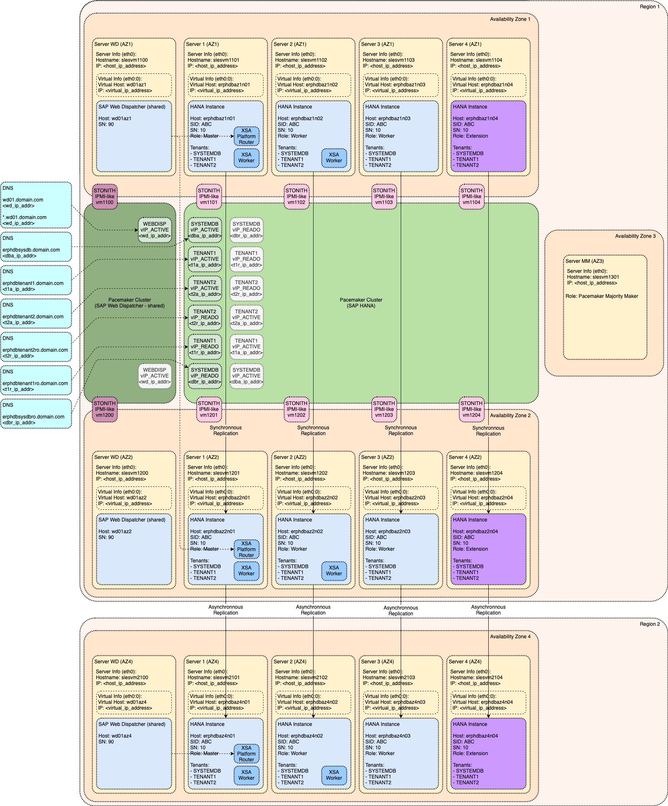

# Module: XSA (SAP HANA extended application services, advanced model)

SAP HANA extended application services, advanced model (XSA) is application server platform used for the development and execution of native data-intensive applications. This module is explaining how to implement SAP XSA as part of this Reference Architecture.

<!-- TOC -->

- [Module: XSA (SAP HANA extended application services, advanced model)](#module-xsa-sap-hana-extended-application-services-advanced-model)
  - [Generic Architecture of SAP XSA](#generic-architecture-of-sap-xsa)
    - [Additional Host Roles](#additional-host-roles)
    - [Tenant Database Installation](#tenant-database-installation)
    - [Routing Mode](#routing-mode)
  - [Reference Architecture of SAP XSA](#reference-architecture-of-sap-xsa)

<!-- /TOC -->

## Generic Architecture of SAP XSA

### Additional Host Roles

Architecture of SAP XSA is introducing new host roles:

- `xs_worker` for active SAP XSA host running XSA applications
- `xs_standby` not used as part of this Reference Architecture - it is used only in case of SAP Host Auto-Failover High Availability option (as documented in section [Alternative Implementations](alternative_implementations.md#alternative-implementations))

These roles can be assigned automatically (each SAP HANA database `worker` host is assigned SAP XSA `xs_worker` role) or manually (only selected hosts are assigned `xs_worker` role, there can be dedicate `xs_worker` host).

Additional Information:

- [Installation and Update Guide: System Concepts for XS Advanced Runtime Installations](https://help.sap.com/viewer/2c1988d620e04368aa4103bf26f17727/2.0.04/en-US/73596bf87326455e8f2c10b83580d91b.html)

### Tenant Database Installation

As of SAP HANA 2.0 SP03 (revision 34) there is option to choose between installation of XSA Platform data into System Database Tenant or into separate Tenant Database.

XSA Platform data contain:

- 

- [Installation and Update Guide: XS Advanced Database Setup Options](https://help.sap.com/viewer/2c1988d620e04368aa4103bf26f17727/2.0.04/en-US/9e27727aac8842ef9fb8431525e97a55.html)

### Routing Mode

SAP XSA is offering option to use either "port based routing mode" or "hostname based routing mode". This Reference Architecture is based on using "hostname based routing mode" which is recommended for productive use.

Additional Information:

- [SAP Note 2245631: Routing Mode and Default Domain configuration for SAP HANA extended application services, advanced model](https://launchpad.support.sap.com/#/notes/2245631)

## Reference Architecture of SAP XSA

Additional Information:
