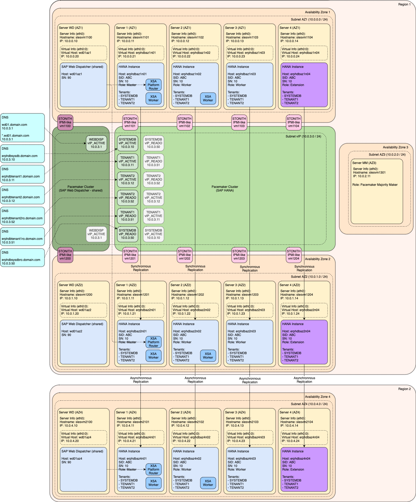
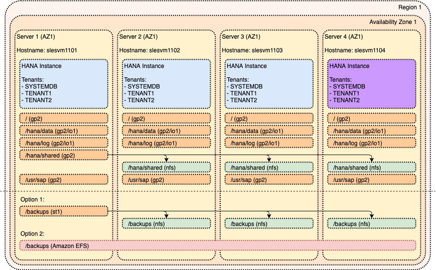

# Platform Specific Architecture for AWS (Amazon Web Services)

Description

<!-- TOC -->

- [Platform Specific Architecture for AWS (Amazon Web Services)](#platform-specific-architecture-for-aws-amazon-web-services)
  - [AWS: Overall Architecture](#aws-overall-architecture)
  - [AWS: Basic Architecture](#aws-basic-architecture)
    - [AWS: Supported Instance Types for SAP HANA](#aws-supported-instance-types-for-sap-hana)
    - [AWS: Storage Setup for SAP HANA Implementation](#aws-storage-setup-for-sap-hana-implementation)
    - [AWS: Networking specifics for AWS Availability Zones](#aws-networking-specifics-for-aws-availability-zones)
  - [AWS: Virtual Hostname/IP](#aws-virtual-hostnameip)
  - [AWS: High Availability](#aws-high-availability)
  - [AWS: Disaster Recovery](#aws-disaster-recovery)
  - [AWS: Data Tiering Options](#aws-data-tiering-options)
    - [AWS: Persistent Memory (NVRAM)](#aws-persistent-memory-nvram)
    - [AWS: SAP HANA Native Storage Extensions (NSE)](#aws-sap-hana-native-storage-extensions-nse)
    - [AWS: SAP HANA Extension Nodes](#aws-sap-hana-extension-nodes)
    - [AWS: SAP HANA Dynamic Tiering (DT)](#aws-sap-hana-dynamic-tiering-dt)
  - [AWS: XSA](#aws-xsa)

<!-- /TOC -->

## AWS: Overall Architecture

Following diagram is illustrating complete version of Reference Architecture for SAP HANA tailored for AWS (Amazon Web Services).

For detailed explanation of individual modules please see individual sections in [Generic SAP HANA Architecture](../../README.md#table-of-content).

You can also review official AWS Reference Architecture and other documentation:

- [AWS: SAP on AWS Technical Documentation: SAP HANA](https://aws.amazon.com/sap/docs/#SAP_HANA)
- [AWS: SAP HANA on the AWS Cloud: Quick Start Reference Deployment](https://docs.aws.amazon.com/quickstart/latest/sap-hana/welcome.html)
- [AWS: Multi-AZ (HA), Single-Node Architecture](https://docs.aws.amazon.com/quickstart/latest/sap-hana/multi-az-single.html)

## AWS: Basic Architecture

Link to generic content: [Module: Basic Architecture](../generic_architecture/module_basic_architecture.md#module-basic-architecture)

### AWS: Supported Instance Types for SAP HANA

Not every instance type is supported for productive SAP HANA usage.

Official list of SAP certified instance types is available at [SAP: The SAP HANA Hardware Directory](https://www.sap.com/dmc/exp/2014-09-02-hana-hardware/enEN/iaas.html#categories=Amazon%20Web%20Services). This should always be used to decide whether the particular instance type is supported for SAP HANA or not.

AWS specific list of certified instances with additional details can be found in [AWS: SAP HANA on AWS Quick Start Guide: AWS Instance Types for SAP HANA](https://docs.aws.amazon.com/quickstart/latest/sap-hana/instances.html)

### AWS: Storage Setup for SAP HANA Implementation

SAP HANA Storage Configuration is coming in two flavors:

- General Purpose SSD (`gp2`) storage - cheaper storage that meets SAP KPI requirements for most of the SAP HANA workloads
- Provisioned IOPS SSD (`io1`) storage - high-performance storage intended for most demanding SAP HANA workloads

Following disk setup is recommended:

| Filesystem    | Name             | Device type  | Comment
|:--------------|:-----------------|:-------------|:----------------
| /             | Root volume      | gp2          |
| /hana/data    | SAP HANA data    | gp2 / io1    |
| /hana/log     | SAP HANA logs    | gp2 / io1    |
| /hana/shared  | SAP HANA shared  | gp2          | Provisioned to the master, NFS-mounted on other nodes
| /usr/sap      | SAP binaries     | gp2          |
| /backups      | SAP HANA backup  | st1          | Provisioned to the master, NFS-mounted on other nodes
| /backups      | SAP HANA backup  | Amazon EFS   | Alternative option for SAP HANA backup filesystem

Instance specific sizing recommendations are available at [AWS: SAP HANA on AWS Quick Start Guide: Storage Configuration for SAP HANA](https://docs.aws.amazon.com/quickstart/latest/sap-hana/storage.html).

### AWS: Networking specifics for AWS Availability Zones

As visualized on the Overall Architecture diagram - in AWS each Availability Zone is having its own subnet. It is not possible to stretch one subnet across multiple Availability Zones. This needs to be taken into consideration during deployment planning.

Impact on implementation of Cluster IP in AWS is described in [AWS: High Availability](#aws-high-availability).

## AWS: Virtual Hostname/IP

Link to generic content: [Module: Virtual Hostname/IP](../generic_architecture/module_virtual_hostname.md#module-virtual-hostnameip)

- how to implement virtual IP - maybe additional elastic network interface?
- reference to Instance Move and how to execute AWS specific steps (move elastic network interface?)

## AWS: High Availability

Link to generic content: [Module: High Availability](../generic_architecture/module_high_availability.md#module-high-availability)

- link to list of Availability Zones in AWS
- comment that it is important to measure AZ latency via niping (I will add this as new section in general part)
- fencing mechanism (options, recommendation)
- how to implement cluster IP (also referred as overlay IP)
  - relation to different subnets per AZ
  - entry in VPC routing table
  - it is managed by cluster (need to assign IAM roles to VM)
  - need to disable source/destination check on interface
- links to AWS/SUSE/RHEL documentation
- how to modify cluster to have active/active
- how to modify cluster to have tenant specific cluster IPs
- anything else?

## AWS: Disaster Recovery

Link to generic content: [Module: Disaster Recovery](../generic_architecture/module_disaster_recovery.md#module-disaster-recovery)

Disaster Recovery for SAP HANA via SAP HANA System Replication is not infrastructure dependent.

## AWS: Data Tiering Options

Link to generic content: [Module: Data Tiering Options](../generic_architecture/module_data_tiering.md#module-data-tiering-options)

Following data tiering options are supposed on AWS:

| Data Tiering Option                                                                     | Supported
|:----------------------------------------------------------------------------------------|:-----------------
| [Persistent Memory (NVRAM)](#aws-persistent-memory-nvram)                               | No
| [SAP HANA Native Storage Extensions (NSE)](#aws-sap-hana-native-storage-extensions-nse) | Yes
| [SAP HANA Extension Nodes](#aws-sap-hana-extension-nodes)                               | Yes
| [SAP HANA Dynamic Tiering (DT)](#aws-sap-hana-dynamic-tiering-dt)                       | Yes

Additional Information:

- [AWS: SAP Data Tiering](https://docs.aws.amazon.com/sap/latest/sap-hana/sap-data-tiering.html)

### AWS: Persistent Memory (NVRAM)

Amazon Web Services platform does not offer any instance types having NVRAM that are supported for productive SAP HANA usage.

### AWS: SAP HANA Native Storage Extensions (NSE)

SAP HANA Native Storage Extensions only need additional disk space compared to regular SAP HANA deployments. Amazon Web Services platform does allow to provision additional disks to SAP HANA VM and add capacity into existing filesystems. There is no change to the design of the storage layout.

### AWS: SAP HANA Extension Nodes

SAP HANA Extension Node implementation is based on provisioning additional SAP HANA node (with increased storage capacity) to existing SAP HANA system. Result is SAP HANA Scale-Out system where one of the nodes is designated as SAP HANA Extension Node. Storage layout is same as for regular SAP HANA nodes and it is visualized above in section [AWS: Storage Setup for SAP HANA Implementation](#aws-storage-setup-for-sap-hana-implementation).

Additional Information:

- [AWS: Warm Data Tiering Options: SAP HANA Extension Node](https://docs.aws.amazon.com/sap/latest/sap-hana/warm-data-tiering-options.html#sap-hana-extension-node)

### AWS: SAP HANA Dynamic Tiering (DT)

SAP HANA Dynamic Tiering (DT) implementation in Amazon Web Services platform is based on provisioning additional VM for Dynamic Tiering component and connecting it to VM hosting SAP HANA instance, thus forming two-node distributed setup. Storage layout is identical to SAP HANA Scale-out setup as illustrated above in section [AWS: Storage Setup for SAP HANA Implementation](#aws-storage-setup-for-sap-hana-implementation).

Additional Information:

- [AWS: Warm Data Tiering Options: SAP HANA Dynamic Tiering](https://docs.aws.amazon.com/sap/latest/sap-hana/warm-data-tiering-options.html#sap-hana-dynamic-tiering)

## AWS: XSA

Link to generic content: [Module: SAP XSA](../generic_architecture/module_xsa.md#module-sap-xsa)

SAP HANA extended application services, advanced model (XSA) component is not infrastructure dependent.
