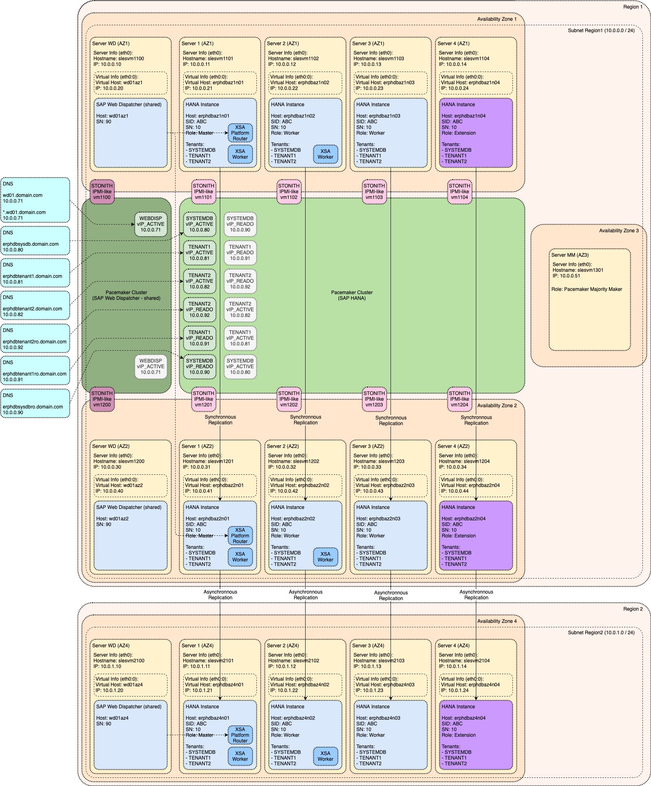
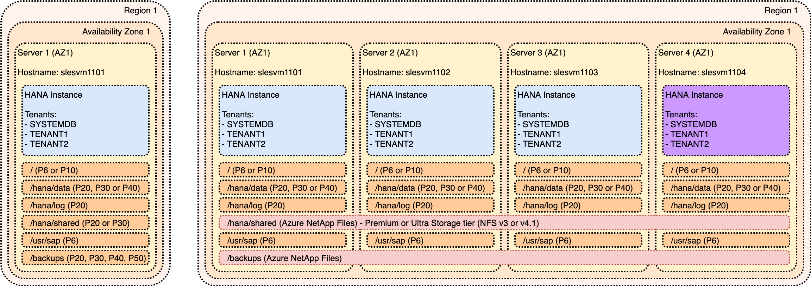

# Platform Specific Architecture for Azure (Microsoft Azure)

Description

<!-- TOC -->

- [Platform Specific Architecture for Azure (Microsoft Azure)](#platform-specific-architecture-for-azure-microsoft-azure)
  - [Azure: Overall Architecture](#azure-overall-architecture)
  - [Azure: Basic Architecture](#azure-basic-architecture)
    - [Azure: Supported Instance Types for SAP HANA](#azure-supported-instance-types-for-sap-hana)
    - [Azure: Storage Setup for SAP HANA Implementation](#azure-storage-setup-for-sap-hana-implementation)
      - [Azure: Storage Setup for SAP HANA Implementation - Azure Premium SSD](#azure-storage-setup-for-sap-hana-implementation---azure-premium-ssd)
      - [Azure: Storage Setup for SAP HANA Implementation - Azure Ultra disk](#azure-storage-setup-for-sap-hana-implementation---azure-ultra-disk)
      - [Azure: Storage Setup for SAP HANA Implementation - Azure NetApp Files](#azure-storage-setup-for-sap-hana-implementation---azure-netapp-files)
    - [Azure: Storage Configurations](#azure-storage-configurations)
  - [Azure: Virtual Hostname/IP](#azure-virtual-hostnameip)
  - [Azure: High Availability](#azure-high-availability)
  - [Azure: Disaster Recovery](#azure-disaster-recovery)
  - [Azure: Data Tiering Options](#azure-data-tiering-options)
  - [Azure: XSA](#azure-xsa)

<!-- /TOC -->

## Azure: Overall Architecture

Following diagram is illustrating complete version of Reference Architecture for SAP HANA tailored for Azure (Microsoft Azure).

For detailed explanation of individual modules please see individual sections in [Generic SAP HANA Architecture](../../README.md#table-of-content).

You can also review official AWS Reference Architecture and other documentation:

- [Azure: SAP HANA infrastructure configurations and operations](https://docs.microsoft.com/en-us/azure/virtual-machines/workloads/sap/hana-vm-operations)
- [Azure: SAP HANA (Large Instances) architecture](https://docs.microsoft.com/en-us/azure/virtual-machines/workloads/sap/hana-architecture)

## Azure: Basic Architecture

Link to generic content: [Module: Basic Architecture](../generic_architecture/module_basic_architecture.md#module-basic-architecture)

### Azure: Supported Instance Types for SAP HANA

Not every instance type is supported for productive SAP HANA usage.

Official list of SAP certified instance types is available at [SAP: The SAP HANA Hardware Directory](https://www.sap.com/dmc/exp/2014-09-02-hana-hardware/enEN/iaas.html#categories=Microsoft%20Azure). This should always be used to decide whether the particular instance type is supported for SAP HANA or not.

Azure specific list of certified instances with additional details can be found in following references:

- [Azure: SAP HANA certifications](https://docs.microsoft.com/en-us/azure/virtual-machines/workloads/sap/sap-certifications#sap-hana-certifications)
- [Azure: Available SKUs for HANA Large Instances](https://docs.microsoft.com/en-us/azure/virtual-machines/workloads/sap/hana-available-skus)

### Azure: Storage Setup for SAP HANA Implementation

SAP HANA Storage Configuration is coming in following flavors:

- [Azure Premium SSD](cloud_iaas_azure.md#azure-storage-setup-for-sap-hana-implementation---azure-premium-ssd) - cheaper storage that meets SAP KPI requirements for most of the SAP HANA workloads
- [Azure Ultra disk](cloud_iaas_azure.md#azure-storage-setup-for-sap-hana-implementation---azure-ultra-disk) - high-performance storage intended for most demanding SAP HANA workloads
- [Azure NetApp Files](cloud_iaas_azure.md#azure-storage-setup-for-sap-hana-implementation---azure-netapp-files) - special option for [SAP HANA Host Auto-Failover (in single Availability Zone)](../generic_architecture/alternative_implementations.md#sap-hana-host-auto-failover-in-single-availability-zone)

Recommended disk setup for each option is described is following sections.

#### Azure: Storage Setup for SAP HANA Implementation - Azure Premium SSD

| Filesystem    | Name             | Device type        | Comment
|:--------------|:-----------------|:-------------------|:----------------
| /             | Root volume      | P6 or P10          |
| /hana/data    | SAP HANA data    | P20, P30 or P40    |
| /hana/log     | SAP HANA logs    | P20                |
| /hana/shared  | SAP HANA shared  | P20 or P30         | For Single-Node deployments
| /hana/shared  | SAP HANA shared  | Azure NetApp Files | For Scale-Out ddeployments
| /usr/sap      | SAP binaries     | P6                 |
| /backups      | SAP HANA backup  | P20, P30, P40, P50 | For Single-Node deployments
| /backups      | SAP HANA backup  | Azure NetApp Files  | For Scale-Out ddeployments

Instance specific sizing recommendations are available at [Azure: Azure Premium SSD](https://docs.microsoft.com/en-us/azure/virtual-machines/workloads/sap/hana-vm-operations-storage#solutions-with-premium-storage-and-azure-write-accelerator-for-azure-m-series-virtual-machines).

#### Azure: Storage Setup for SAP HANA Implementation - Azure Ultra disk

- [Azure: Azure Ultra disk](https://docs.microsoft.com/en-us/azure/virtual-machines/workloads/sap/hana-vm-operations-storage#azure-ultra-disk-storage-configuration-for-sap-hana)

#### Azure: Storage Setup for SAP HANA Implementation - Azure NetApp Files

- [Azure: Azure NetApp Files](https://docs.microsoft.com/en-us/azure/virtual-machines/workloads/sap/hana-vm-operations-storage#nfs-v41-volumes-on-azure-netapp-files)

- supported instance types
- description of single node implementation (storage) + picture
- description of scale-out implementations (storage) + picture
- mention that subnets are stretched across AZs
- links to Azure documentation

### Azure: Storage Configurations

- visualization of storage for Azure

## Azure: Virtual Hostname/IP

Link to generic content: [Module: Virtual Hostname/IP](../generic_architecture/module_virtual_hostname.md#module-virtual-hostnameip)

- how to implement virtual IP - maybe additional network interface?
- reference to Instance Move and how to execute Azure specific steps (move network interface?)

## Azure: High Availability

Link to generic content: [Module: High Availability](../generic_architecture/module_high_availability.md#module-high-availability)

- link to list of Availability Zones in Azure
- comment that it is important to measure AZ latency via niping (I will add this as new section in general part)
- fencing mechanism (options, recommendation)
- how to implement cluster IP (as load balancer)
  - explain why we need load balancer (no ARP invalidations)
  - it is managed by cluster (explain how - but opening port on active node)
  - link to [Video](https://youtu.be/axyPUGS7Wu4) and [PDF](https://www.suse.com/media/presentation/TUT1134_Microsoft_Azure_and_SUSE_HAE%20_When_Availability_Matters.pdf)
- links to Azure/SUSE/RHEL documentation
- how to modify cluster to have active/active
- how to modify cluster to have tenant specific cluster IPs
- anything else?

## Azure: Disaster Recovery

Link to generic content: [Module: Disaster Recovery](../generic_architecture/module_disaster_recovery.md#module-disaster-recovery)

- anything to consider? bandwidth?

## Azure: Data Tiering Options

Link to generic content: [Module: Data Tiering Options](../generic_architecture/module_data_tiering.md#module-data-tiering-options)

- what is supported what is not (matrix)
- links to Azure documentation
- modified pictures of storage setup (if required)

## Azure: XSA

Link to generic content: [Module: SAP XSA](../generic_architecture/module_xsa.md#module-sap-xsa)

- I think there is nothing infrastructure specific
