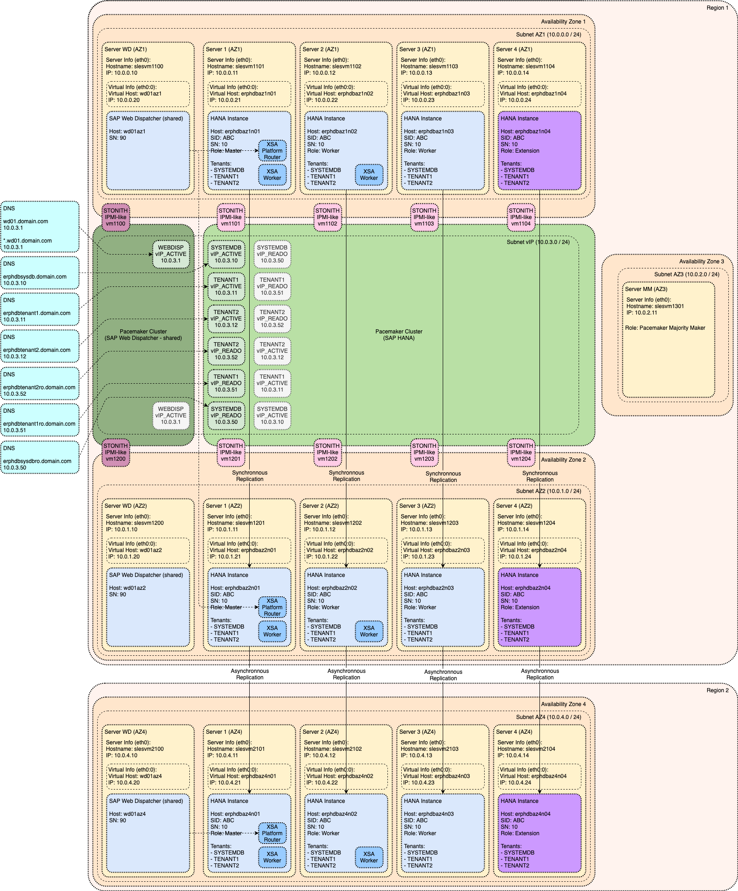

# Platform Specific Architecture for AWS (Amazon Web Services)

Description

<!-- TOC -->

- [Platform Specific Architecture for AWS (Amazon Web Services)](#platform-specific-architecture-for-aws-amazon-web-services)
  - [AWS: Overall Architecture](#aws-overall-architecture)
  - [AWS: Implementation of Cluster IP](#aws-implementation-of-cluster-ip)

<!-- /TOC -->

## AWS: Overall Architecture

## AWS: Implementation of Cluster IP
